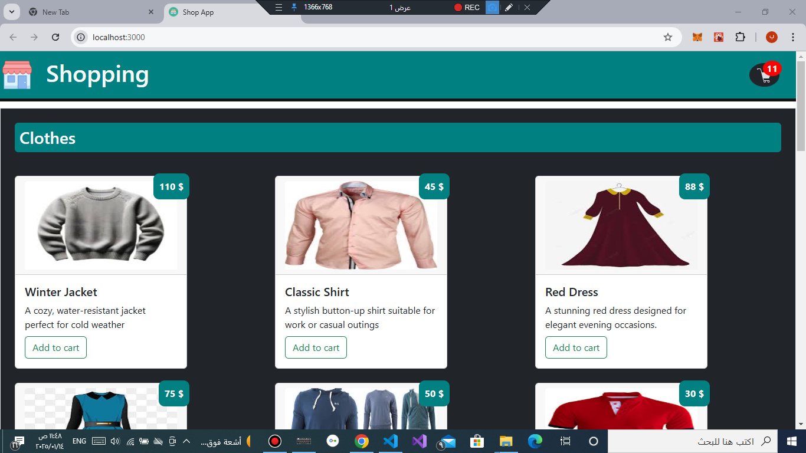
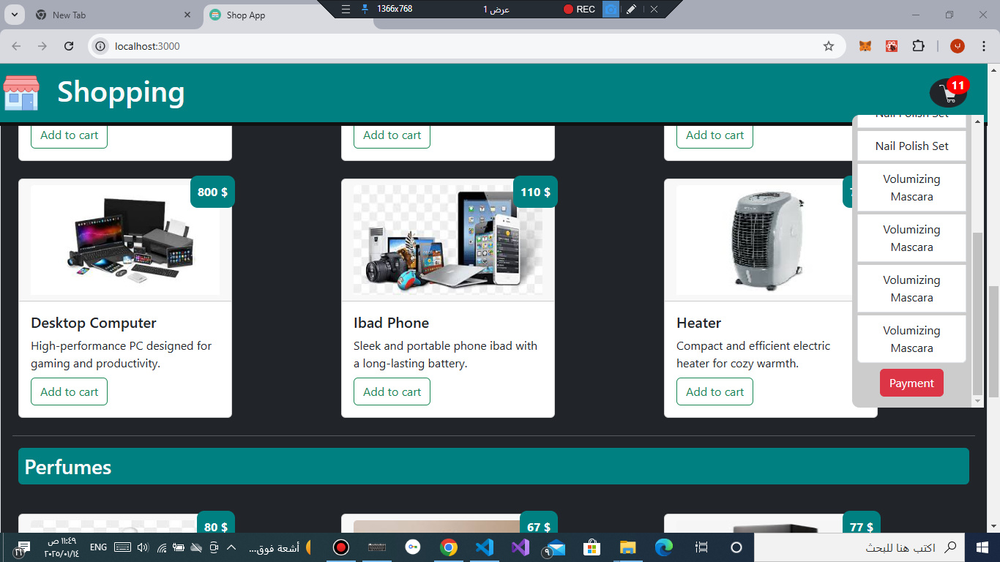
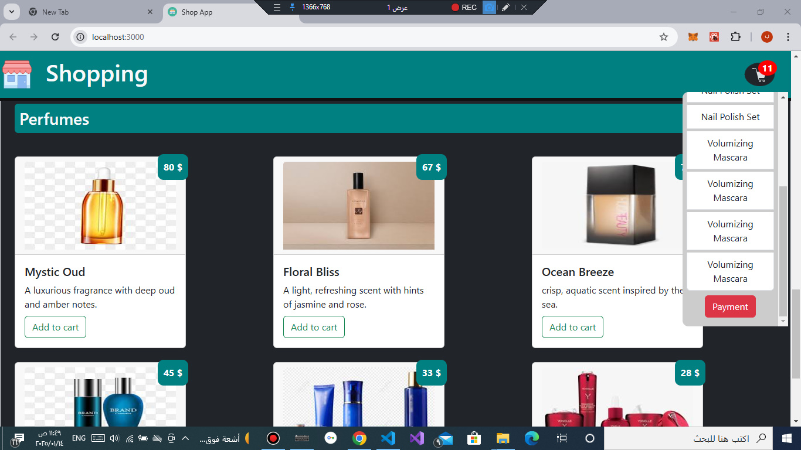

# متجر إلكتروني باستخدام React

هذا المشروع هو تطبيق متجر إلكتروني بسيط مبني باستخدام مكتبة React. يتم جلب بيانات المنتجات من RESTful API، مما يجعل التطبيق ديناميكيًا وسهل التحديث.

---

## الميزات

- عرض قائمة بالمنتجات.
- تصنيف المنتجات حسب الأصناف.
- التصميم  متجاوب مع جميع الأجهزة.
- جلب البيانات ديناميكيًا من RESTful API.
- واجهة مستخدم بسيطة وسهلة الاستخدام.
- إدارة حالة البيانات باستخدام **React Hooks** مثل `useState` و `useEffect`.

---

## التقنيات المستخدمة

- **React**: لإنشاء الواجهة التفاعلية.
- **Axios**: للتعامل مع RESTful API.
- **CSS/Styled Components -- Bootstarp**: لتصميم الواجهة.
- **RESTful API**: كمصدر بيانات المنتجات.

---

## طريقة التشغيل

### 1. تثبيت المتطلبات:
قبل بدء المشروع، تأكد من تثبيت **Node.js** على جهازك. ثم قم بتثبيت حزم المشروع باستخدام:

```bash
npm install
```

### 2. تشغيل التطبيق:
لتشغيل التطبيق على بيئة التطوير، استخدم الأمر:

```bash
npm start
```

سيتم فتح التطبيق على المتصفح تلقائيًا عبر الرابط: [http://localhost:3000](http://localhost:3000)

---

## استخدام API
```bash
cd server
node server.js
```
الرابط:
  ```
 [https://localhost:4000]
  ```
### API المستخدمة:
- **الأصناف**: يتم جلب قائمة الأصناف من الرابط:
  ```
  GET https://localhost:4000/items
  ```
- **المنتجات**: يتم جلب المنتجات باستخدام معرف الصنف:
  ```
  GET https://localhost:4000/products
  ```

**ملاحظات**:
- يجب أن يحتوي كل منتج على الحقول التالية: 
  - `id` (معرف المنتج)
  - `ItemId` (معرف الصنف)
  - `name` (اسم المنتج)
  - `price` (سعر المنتج)
  - `descripe` (وصف المنتج)
  - `img` (رابط الصورة)

---

---

## المزايا المستقبلية (TODO)

- إضافة ميزة البحث عن المنتجات.
- دعم العربة الشرائية (Shopping Cart).
- إضافة مصادقة المستخدم.

---

## متطلبات النظام

- **Node.js**: إصدار 16 أو أحدث.
- **npm**: إصدار 7 أو أحدث.

---

## المساهمة

مرحب بأي مساهمات لتطوير هذا المشروع! إذا كنت ترغب في المساهمة، قم بفتح فرع جديد، نفذ التعديلات، وأرسل طلب دمج (Pull Request).

---

## الترخيص

هذا المشروع مفتوح المصدر بموجب [MIT License](LICENSE).

---

## معاينة





---
